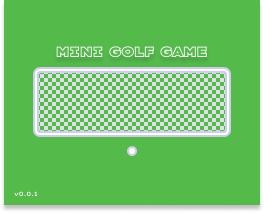

> #### Mini Golf Game in Python
> A golf-game based in python and pygame. That introduce some levels to get in the objective with crossing a camp to find a hole to get in, increasing your score and the velocity, increasing the difficulty too.
> Objective: a golf game with simple interface and gameplay structure

> #### From Pygame
> Library from Pygame to Support in the Creation of the Game.
> - [x] pygame.sprite
> - [x] pygame.locals
> - [x] pygame.key
> - [x] pygame.event 
> - [x] pygame.display
> - [x] pygame.clock
> - [x] pygame.mixer
> - [x] pygame.font

> #### Implementations
> Implementations made in structure of Code to Generate a Good Game.
> - [x] Movement using Vector2
> - [x] Sprites
> - [x] Collide Rect for Collision
> - [x] UI Text
> - [x] Audio Effects
> - [x] Score System
> - [x] Difficulty Variation
> - [x] Random Spawn to the Holes