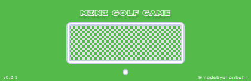

> #### Mini Golf Game in Python
> A golf-game based in python and pygame. That introduce some levels to get in the objective with crossing a labirint.
> Objective: a golf game with simple interface and gameplay

> #### From Pygame
> Library from Pygame to Support in the Creation of the Game.
> - [x] pygame.sprite
> - [x] pygame.locals
> - [x] pygame.key
> - [x] pygame.event 
> - [x] pygame.display
> - [x] pygame.clock
> - [x] pygame.mixer

> #### Implementations
> Implementations maded in structure of Code to Generate a Good Game.
> - [x] Moviment using Vector2
> - [x] Sprites
> - [x] Collide Rect for Collision
> - [ ] Next Step?

